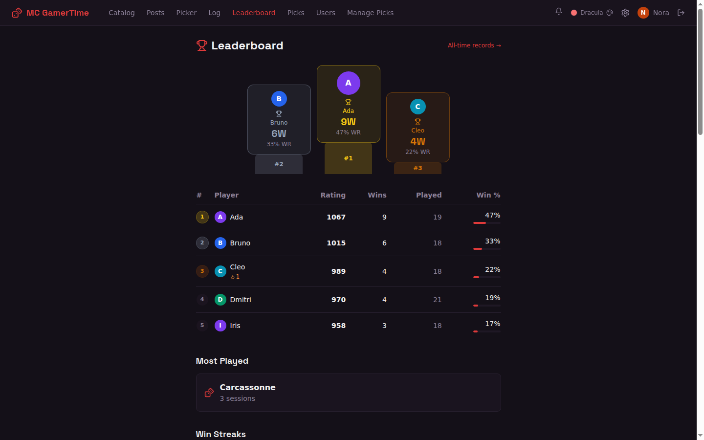
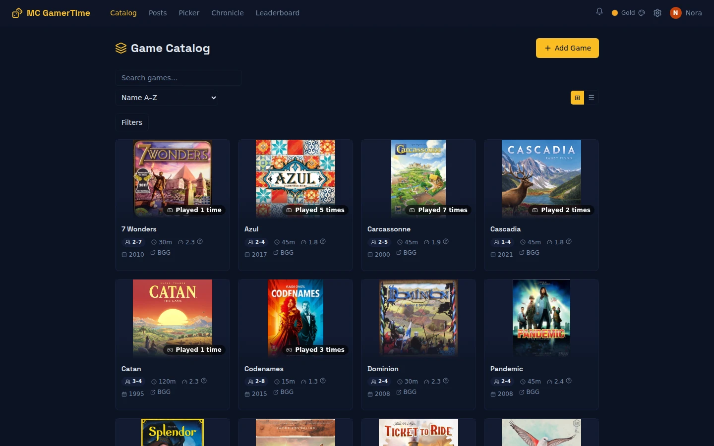
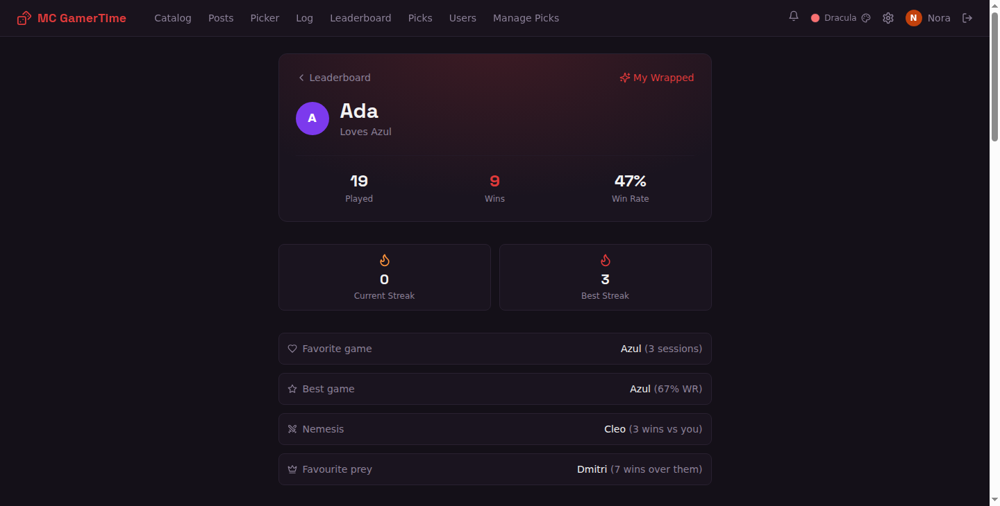
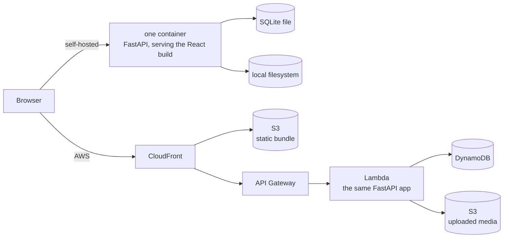

# MC GamerTime

[](https://github.com/Strandgaard96/mc-gamertime/actions/workflows/ci.yml)
[](https://github.com/Strandgaard96/mc-gamertime/pkgs/container/mc-gamertime)
[](https://github.com/Strandgaard96/mc-gamertime/releases)
[](LICENSE)
[](https://mcgamertime-docs.drmaggi.com)
[](#built-with-claude-code)

**Board game inventory tracker and game logger**
- Elo ratings
- Head-to-head records, 
- Achievements
- Player stats
- Board Game Geek API support for the game catalog.**


Self-host it, or use the built-in support for serverless hosting on AWS for ≈$0 a month.



| | |
|---|---|
|  |  |


## Contents

- [Built with Claude Code](#built-with-claude-code)
- [Quick start](#quick-start)
  - [1. Self-hosted with Docker](#1-self-hosted-with-docker)
  - [2. Cloud-hosted on AWS](#2-cloud-hosted-on-aws)
- [Stack](#stack)
- [Features](#features)
- [Contributing](#contributing)
- [License](#license)

## Built with Claude Code

Claude Code wrote most of the code. My background is scientific computing with extensive
AWS experience and I did this project to learn frontend coding and agent orchestration in a full-stack application.

> [!WARNING]
> The project is vibe-coded and should be treated as such.

The setup used to build it is in [CLAUDE.md](./CLAUDE.md), with these plugins:

- [superpowers](https://github.com/obra/superpowers) — brainstorming, subagent-driven development, TDD, systematic debugging
- [frontend-design](https://github.com/anthropics/claude-plugins-public/tree/main/plugins/frontend-design) — non-generic UI design guidance
- [chrome-devtools-mcp](https://github.com/ChromeDevTools/chrome-devtools-mcp) — live browser inspection and automation

## Quick start

### 1. Self-hosted with Docker

One container, embedded SQLite, local file storage.


**To install:**

```bash
curl -fsSL https://raw.githubusercontent.com/Strandgaard96/mc-gamertime/main/docker-compose.yml -o docker-compose.yml
echo "ADMIN_USERNAME=admin" >> .env
echo "ADMIN_PASSWORD=<your-password>" >> .env
docker compose up -d
```

`ADMIN_USERNAME`/`ADMIN_PASSWORD` are the **only required setting** — they bootstrap your
first admin account on first boot. Everything else — `BGG_TOKEN` for game search, `SMTP_*` for
password-reset email, `APP_BASE_URL`, `CORS_ALLOWED_ORIGINS`, etc. — is optional with a
working default; see [`.env.example`](./.env.example) or the [full config
reference](https://mcgamertime-docs.drmaggi.com/self-hosting/configuration/).

Open <http://localhost:4263> and log in.

For setup of remote access see [HTTPS / Reverse
Proxy](https://mcgamertime-docs.drmaggi.com/self-hosting/https/) and the
[security model](https://mcgamertime-docs.drmaggi.com/self-hosting/security/).

[Full self-hosting guide →](https://mcgamertime-docs.drmaggi.com/self-hosting/quickstart/)

### 2. Cloud-hosted on AWS

Host the app on AWS serverless infrastructure, provisioned by Terraform. Everything
is pay-per-request, which for regular personal use amounts to roughly **$0/month** — the free tier covers
it. Worth choosing if you want easy remote access and experience with cloud hosting while gaining the security benefits of AWS hosted infrastructure.

#### Prerequisites
An AWS account, plus Terraform, Node.js and Task installed — and **a domain name you own**.
The domain is not optional: CloudFront needs an ACM certificate, and ACM only issues one for
a domain you control.

```bash
cp infra/terraform.tfvars.example infra/terraform.tfvars
# then set: domain = "example.com"
```

`domain` in `infra/terraform.tfvars` is the **only required setting** - `terraform apply` refuses to run without it. Everything
else (`subdomain`, `bgg_token`, `alert_email`, `cloudfront_web_acl_arn`,
`extra_cors_origins`, `aws_region`) has a working default; see
[`infra/terraform.tfvars.example`](./infra/terraform.tfvars.example) or the [full AWS
guide](https://mcgamertime-docs.drmaggi.com/cloud-deploy/aws/) for what each does. 

For full AWS installation instructions see: [Full AWS guide →](https://mcgamertime-docs.drmaggi.com/cloud-deploy/aws/).

The security considerations for the AWS hosted app are described here:
[Security & privacy on AWS →](https://mcgamertime-docs.drmaggi.com/cloud-deploy/security/).


## Stack

- **Frontend** — React 18, Vite, TypeScript, Tailwind, TanStack Query, Recharts
- **Backend** — Python, FastAPI; uvicorn when self-hosted, Lambda + Mangum on AWS
- **Data** — embedded SQLite, or DynamoDB
- **Storage** — local filesystem, or S3; uploaded media is served by the app behind auth,
  never straight from the bucket
- **Infra** — Terraform, GitHub Actions, release-please



<details>
<summary>Diagram source (Mermaid)</summary>



</details>

## Features

| | |
|---|---|
| **Leaderboard** | Elo rating per player, win rates, streaks, head-to-head records |
| **Game catalog** | Search Board Game Geek, keep player counts, weights and cover art |
| **Session log** | Who played, who won, seats, scores, mood — plus per-game custom fields |
| **Achievements** | Milestones detected automatically as results come in |
| **Player profiles** | Favourite game, nemesis, best month, Elo history |
| **Blog** | Session recaps with rich text and images |

[Screenshots and detail →](https://mcgamertime-docs.drmaggi.com/features/)

## Contributing

- [Contributing guide](./CONTRIBUTING.md)
- [Architecture walkthrough](https://mcgamertime-docs.drmaggi.com/contributing/architecture/) — how a request flows end to end
- [Recipes](https://mcgamertime-docs.drmaggi.com/contributing/recipes/) — add an endpoint, a page, a table
- [Security policy](./SECURITY.md) — report a vulnerability privately

## License

[MIT](./LICENSE)

<!-- ci path-filter smoke test, PR will be closed unmerged -->
