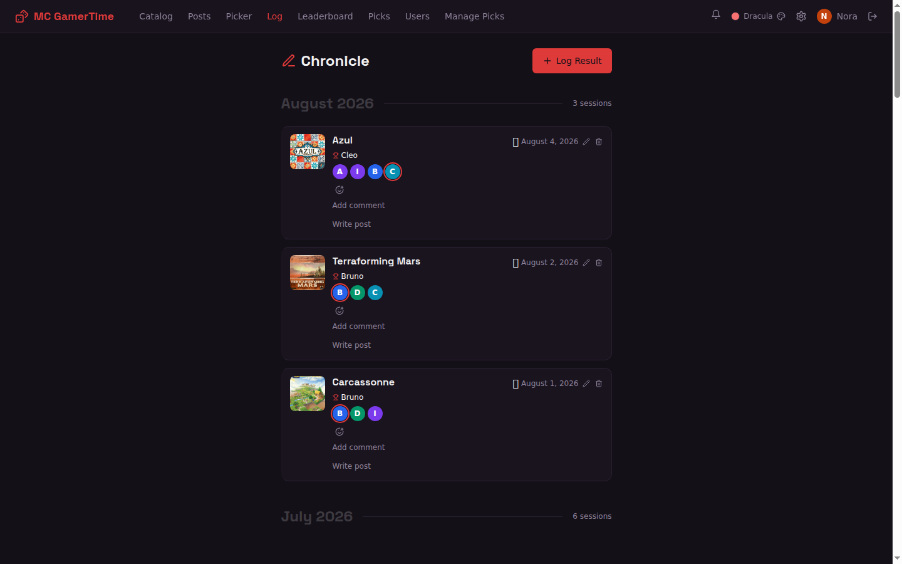

MC GamerTime is a web app for tracking board game nights with friends. Self-host it with Docker, or deploy it to AWS for roughly $0/month. Here's what you get out of the box.

## Leaderboard

Wins, losses and an Elo rating for every player across all games, with a podium for the top three, head-to-head records, win streaks, and sessions-per-month charts.

## Game Catalog

Search the Board Game Geek database to add games to your library. Each game stores player count, complexity rating, and full BGG metadata including cover art. Requires a BGG API token — see [Configuration](/self-hosting/configuration/).

## Log a Result

Record who played, who won, seat positions, player scores, and session mood. Supports per-game custom variables (e.g. faction played, role). Past results can be edited.

## Achievements

Awarded automatically when a result is logged — first win, win streaks, games-played milestones, and more. Players see earned achievements on their profile. New achievement definitions are added in code.

## Player profiles and records

Per-player statistics: win rate, favourite game, nemesis, longest streaks, Elo history, a "game passport" of everything played, and a Wrapped-style year recap. A separate Records page lists all-time records: longest streaks, busiest day, most active month.

## Blog

Write session recaps with rich text and embedded images. Images are uploaded to local filesystem storage and served via the app proxy — no external image hosting needed.

## User management

Admins manage users from the app itself — create, edit, and delete accounts on the Users
page. The same operations exist as CLI scripts (`scripts/create-user.py`,
`update-user.py`, `delete-user.py`, `revoke-sessions.py`), which is how you bootstrap the
very first admin and how you revoke every session for a user.

Two roles: `admin` (full CRUD) and `readonly` (no admin actions, but can still react,
comment, favorite games, and set their own avatar).
