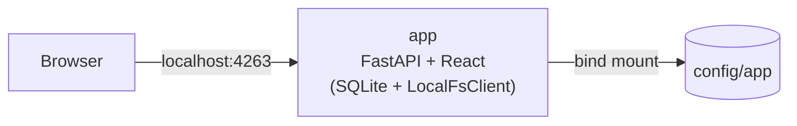

import { Aside, FileTree } from '@astrojs/starlight/components';

MC GamerTime runs as a single `mc-gamertime` container (FastAPI + React, embedded SQLite, local filesystem storage). A one-shot `mc-gamertime-init` container runs first to fix ownership on the bind-mounted `config/` directory, then exits. There is no built-in reverse proxy or TLS termination — see [HTTPS / Reverse Proxy](/self-hosting/https/) for bringing your own.

## Container diagram

## Config folder

Runtime data lives in `./config/` on the host — no Docker volume commands needed.

<FileTree>
- config/
  - app/
    - boardsite.db  SQLite database
    - .jwt_secret  auto-generated, mode 0600, never served
    - storage/
      - avatars/  user avatar PNGs
      - blog-images/  blog post uploads
      - game-images/  game cover uploads
</FileTree>

<Aside type="caution">
`docker compose down -v` has no effect on this data — bind-mounted directories are not deleted by `-v`. To fully wipe all data, delete the `config/` directory manually after bringing the stack down.
</Aside>

## Database scale

The SQLite backend mirrors the DynamoDB data model: one table per entity type, each row a
primary key plus a JSON document, and list endpoints read the whole table. There are no
secondary indexes. That is the right trade for a friend group logging a few hundred
sessions a year; it is not built for thousands of players or tens of thousands of results.
If you outgrow it, the AWS deployment is the intended next step.

Port 4263 is the only port exposed to the host. See [Quickstart → What's running](/self-hosting/quickstart/#whats-running).
